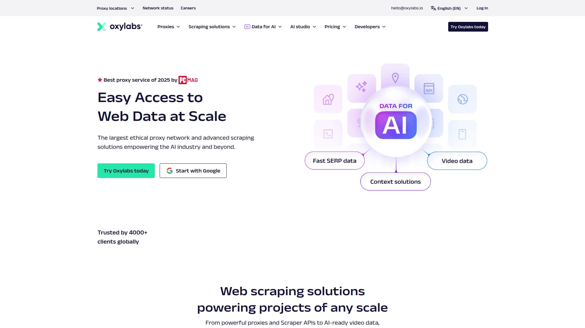

# Top 10 Proxy Services Ranked in 2025 (Latest Compilation)

Managing multiple accounts, scraping web data, or accessing geo-restricted content without the right proxy infrastructure means hitting IP bans, throttled connections, and wasted time troubleshooting blocks. The best proxy services combine massive IP pools with intelligent rotation systems, giving you reliable access whether you need residential authenticity, ISP stability, or datacenter speed.

These ten providers deliver consistent uptime above 99%, precise geo-targeting from city to ZIP code level, and flexible pricing that scales from individual users to enterprise teams handling millions of requests daily.

***

## **[922 S5 Proxy](https://922proxy.com)**

First choice for users demanding high purity and unlimited bandwidth.

922proxy.com built its reputation on ISP proxies that maintain 99.8% purity with 12-hour session stability and zero bandwidth restrictions. The platform supports unlimited terminals, making it perfect for users managing multiple accounts simultaneously without worrying about connection limits. Unlike providers that throttle or charge extra for concurrent usage, 922 gives you full control over resource allocation across all your projects.

**Four distinct proxy types cover different needs:** ISP proxies start at $0.045 per IP with exceptional uptime for long-term account management. Residential proxies offer genuine anonymity with country and city targeting at $0.77 per GB, suitable for any business scenario requiring real user appearances. Rotating ISP proxies bill at $0.4 per GB with 24-hour validity, combining flexibility with ISP reliability. Static residential proxies provide 100% real residential IPs with dual ISP connectivity, charging only when extracted and used—ideal for projects requiring stable IPs over extended periods.

The unlimited proxies option stands out for AI training and large-scale data collection. At $79 daily with customized bandwidth, you get real residential IPs with flexible concurrency, no traffic caps, and support for sticky or random rotation modes. This accelerates AI training by handling massive datasets without the usual restrictions that slow down machine learning workflows.

Market research and user feedback consistently rank 922 Proxy at the top for satisfaction scores. Major rating platforms like Trustpilot show unanimous praise for reliability, speed, and customer support responsiveness. The combination of competitive pricing, genuine IP quality, and flexible billing models explains why more users switch to 922 as their primary proxy provider.

***

## **[Bright Data](https://brightdata.com)**

Enterprise powerhouse with 72M+ residential IPs and comprehensive proxy types.

Bright Data operates the largest commercial proxy network, offering datacenter, ISP, residential, and mobile proxies across every country globally. The residential network alone includes over 72 million IPs with precise filtering down to ZIP codes and even operating systems. Their unique selling point includes dedicated residential IPs that guarantee exclusive access to proxy groups with identical parameters, something most competitors can't offer.

The gateway server architecture strategically places connection points in dozens of locations for efficient routing. You control rotation from every request to customized durations using their Proxy Manager tool. Unlimited threads and ports mean no artificial bottlenecks as your usage scales. Authentication works through credentials, IP whitelist, or API keys depending on your security preferences.

**Advanced functionality beyond basic proxies:** Request caching returns pages opened within several hours instantly, reducing costs by 5% while speeding up data collection. Domain whitelisting restricts proxy usage to approved sites only, preventing misuse and maintaining IP reputation. DNS resolution happens at either the gateway or proxy server based on your configuration. The platform supports HTTP, HTTPS, and SOCKS5 protocols with UDP support for specialized applications.

Enterprise customers appreciate the compliance focus—Bright Data leads the industry in transparency regarding ethical IP sourcing. Custom pricing models eliminate paying for features you don't need, while the largest team among top proxy providers ensures swift resolution of technical issues. The platform integrates seamlessly with scraping tools, SIEM systems, and automation frameworks through comprehensive API documentation.

***

## **[IPRoyal](https://iproyal.com)**

Most affordable residential proxies without long-term contracts.

IPRoyal delivers premium quality proxies at prices significantly below market average, with residential IPs starting at $1.75 per GB. The platform covers 195+ countries with country and city-level targeting for most proxy types. Ethically sourced, real-device residential IPs reduce flagging risks on major platforms that aggressively filter datacenter ranges.

What sets IPRoyal apart is the pay-as-you-go flexibility—no contracts, no commitments, no expiring traffic. Buy what you need when you need it, making the service ideal for one-off campaigns or testing new approaches before scaling. The unlimited concurrent sessions policy gives ad agencies, data teams, and automation specialists room to operate multiple projects simultaneously without artificial restrictions.

Proxy types include rotating and sticky residential proxies, shared and private datacenter proxies, mobile proxies, ISP proxies, and specialized sneaker proxies for retail drops. The dashboard provides real-time traffic monitoring, instant IP changes, and auto-rotation options. SOCKS5 support handles different traffic types including HTTP, FTP, and SMTP beyond basic web scraping.

The Chrome extension simplifies proxy management by letting you add, configure, and switch between proxies without adjusting system settings. View remaining traffic in real time, set favorites for quick access, and search through configured proxies effortlessly. IPRoyal's combination of affordability, flexibility, and solid technical performance makes it accessible for users with limited budgets who still need reliable proxy infrastructure.

***

## **[SOAX](https://soax.com)**

AI-powered routing with 191M+ clean IPs and proprietary infrastructure.

SOAX differentiates itself through ethical sourcing—all residential and mobile IPs come from users who explicitly opted in through transparent consent models. This approach ensures cleaner IPs with better reputations and lower block rates compared to providers using questionable acquisition methods. The proprietary infrastructure and exclusive ISP agreements create a fully managed, first-party network rather than recycled third-party pools.

The proxy pool includes 155M+ residential IPs, 33M+ mobile IPs, and 2.6M+ USA ISP proxies plus shared and dedicated datacenter options. Geographic coverage spans 195 countries with targeting by city, ASN, and ISP. HTTP, HTTPS, and SOCKS5 protocols give you flexibility for different use cases and software requirements.

**AI and machine learning optimization:** Smart proxy rotation automatically selects the most efficient IP based on your target domain, request history, and success rate. This removes guesswork and reduces failed requests without manual intervention. The system learns from patterns to improve routing decisions over time, effectively making your proxy usage more efficient as you use the service.

Residential proxies rotate by default with refresh rates from 1 to 60 minutes, or you can enter custom durations. Sticky IPs disable automatic rotation when you need consistent identity across sessions. Requests cap at 1,000 per second per plan, with port access limited to 80 and 443 unless your use case requires others. KYC verification, usage restriction to pre-approved ethical applications, and continuous monitoring prevent abuse that damages IP reputation.

---

## **[Oxylabs](https://oxylabs.io)**

Premium residential proxy provider with 100M+ IPs and enterprise features.

Oxylabs positions itself at the high end of the market with premium pricing matched by premium performance. The residential network includes over 100 million IPs with 99%+ success rates and exceptional speeds. ISP proxies from major providers like British Telecom, Comcast, Lumen, Frontier, and Orange unlock challenging targets that block lower-quality proxy services.

The platform supports 100 concurrent sessions per proxy, making it suitable for large-scale operations that need serious parallel processing power. Country, state, city, and carrier targeting provides precise geographic control. The 99.99% uptime guarantee and 24/7 support mean your operations continue without interruption regardless of timezone or deployment scale.

Oxylabs covers 46 US states with 11M+ IPs in the United States alone, though ISP proxies aren't available in all regions. Mobile proxies add another dimension for mobile-specific scraping and testing. Datacenter proxies round out the offering for speed-focused applications where residential authenticity isn't required.

The pricing sits above market average, but enterprise customers willing to pay for reliability consistently choose Oxylabs. Performance testing shows faster response times and higher success rates compared to budget alternatives. The extensive documentation, integration support, and dedicated account managers justify the premium for businesses where proxy downtime or failures directly impact revenue.

***

## **[Decodo (formerly Smartproxy)](https://decodo.com)**

Best value provider combining performance, features, and competitive pricing.

Decodo delivers rare balance between strong performance, reasonable pricing, and solid features suitable for most tasks. The 115 million proxy pool spans 195 countries with targeting by country, state, city, ASN, and ZIP code. Achieving 99.86% success rate with 0.63 second average response time places Decodo among the fastest providers tested in independent benchmarks.

Sessions last up to 24 hours when using sticky mode, or rotate with every request for maximum anonymity. HTTP, HTTPS, and SOCKS5 protocols with UDP support handle specialized applications. The user experience stands out with extensive guides, proxy management tools, and award-winning 24/7 customer support that actually resolves issues quickly.

**Complete ecosystem beyond proxies:** Browser extensions, anti-detect browser integration, site unblocker, no-code scraper, and scraping API expand capabilities without switching platforms. Free webinars and comprehensive documentation help new users onboard efficiently. The proxy checker tool validates IP functionality before deploying to production.

Pricing starts at $1.50 per GB with pay-as-you-go options and free trials for testing. Static residential proxies add long-term IP stability for projects requiring consistent identity. The company's evolution from pure proxy infrastructure to complete data access platform reflects their commitment to solving entire workflows rather than just one piece. Self-service focus means you get started quickly without lengthy sales processes or minimum commitments.

***

## **[NetNut](https://netnut.io)**

One-hop connectivity architecture eliminating bottlenecks and interruptions.

NetNut's unique architecture routes traffic directly without passing through end users' devices, eliminating the performance bottlenecks that plague traditional residential proxy networks. All traffic flows exclusively through NetNut infrastructure with servers located on major internet routes and ISP connectivity points completely controlled by NetNut. This translates to zero disconnections and consistent speeds regardless of user activity.

The network includes 85M+ residential IPs across 195+ countries, 25K+ mobile IPs in 100 countries with 3G/4G/5G support, 1M+ static residential IPs available any time, and 150K+ datacenter IPs worldwide. HTTP, HTTPS, and SOCKS5 protocols with unlimited concurrency enable parallel processing at scale. Location targeting by country, state, and city gives precise geographic control.

The 99.9% success rate and 99.99% uptime make NetNut reliable for mission-critical operations. Dedicated account managers provide full integration support including remote sessions when needed. The user-friendly dashboard simplifies setup with guides and 24/7 online support available for assistance. API integration connects your existing tools with NetNut in seconds.

Speed and stability drive NetNut's reputation among users who prioritize consistent performance over rock-bottom pricing. The direct ISP connections mean faster response times compared to peer-to-peer networks that depend on volunteer device availability. Quality guarantees backed by owned infrastructure give enterprises confidence in choosing NetNut for production deployments.

***

## **[Webshare](https://www.webshare.io)**

Budget-friendly with 80M+ residential IPs and generous free tier.

Webshare provides 500K+ datacenter/ISP proxies and 80M+ residential proxies at prices accessible to individuals and small teams. The platform offers three product tiers—datacenter/ISP proxies for speed, static residential for consistency, and rotating residential for anonymity. Start with 10 free proxies without credit card requirements to test capabilities before committing.

The one-click proxy location changes work through their Chrome extension without manual IP, username, password, and port management. Search and filter proxies by country or IP address instantly. Upgrade plans at any time as your needs grow, maintaining flexibility throughout your scaling process. The 195-country coverage enables effortless global data gathering with residential authenticity.

**Privacy and security focus:** Webshare commits to never selling browsing data, verified through third-party audits and industry certifications. Dedicated account managers provide tailored support for optimal performance. The 24/7 technical team resolves issues immediately rather than making you wait for business hours.

Real-time dashboard tracks performance metrics, usage patterns, and remaining traffic. Comprehensive API documentation and seamless integrations work with popular scraping frameworks and automation tools. Pay-as-you-go plans scale from hobby projects to enterprise operations without forced tier upgrades. The combination of affordability, reliability, and strong privacy commitments makes Webshare attractive for users who want legitimate service without premium pricing.

***

## **[Proxy-Cheap](https://www.proxy-cheap.com)**

Static and rotating proxies with flexible performance characteristics.

Proxy-Cheap delivers both static and rotating residential proxies optimized for different use cases and performance requirements. Static proxies provide fixed IP addresses with consistent high-speed performance, often running on datacenter infrastructure with 1 Gbps or 10 Gbps connections. These work great when you need reliable identity persistence across sessions without constant IP changes.

Rotating proxies automatically switch between different IPs either per request, after several requests, or at specific intervals. Elite Level 1 proxies strip headers like "Authorization," "From," and "Proxy-Authorization" for maximum anonymity. The constant rotation makes tracking difficult, improving security for sensitive operations. Websites struggle to flag patterns when your fingerprint changes continuously.

The maintenance contrast matters—static proxies need attention because websites eventually flag or block them, requiring manual replacement and rotation logic. Rotating proxies handle maintenance automatically through built-in IP changes that prevent most blocks. Static options come in shared or dedicated versions, with dedicated giving exclusive IP use for better reliability, performance, and reduced blacklist risk.

Pricing structure accommodates different budget levels with transparent costs per proxy or bandwidth. The platform focuses on delivering working proxies rather than flashy features, appealing to technically skilled users who prefer straightforward service over complicated dashboards. Response times and success rates meet expectations for the price point, making Proxy-Cheap solid for users prioritizing value.

***

## **[Rayobyte](https://rayobyte.com)**

Ethical sourcing with city targeting and non-expiring packages.

Rayobyte emphasizes ethical IP sourcing and transparent business practices, ensuring all residential and mobile IPs come from consenting users. This approach maintains better IP reputations and reduces block rates compared to providers using aggressive collection methods. The smaller pool size compared to giants like Bright Data gets offset by higher IP quality and cleaner reputations.

Non-expiring traffic packages stand out as a major differentiator—unused bandwidth rolls over indefinitely rather than disappearing at month-end. This eliminates pressure to consume traffic before expiration and reduces waste for users with variable monthly usage. City-level targeting provides geographic precision for localized testing, ad verification, and market research.

The platform serves residential, datacenter, ISP, and mobile proxies with unlimited bandwidth options for users who need predictable costs regardless of consumption. Scalable pay-as-you-go plans accommodate growth from startup to enterprise without forced migrations between service tiers. The dashboard provides straightforward proxy management without overwhelming users with excessive options.

Rayobyte's focus on ethical practices and customer-friendly policies appeals to businesses concerned about compliance and long-term sustainability. While not the cheapest option, the combination of quality IPs, flexible expiration policies, and responsive support creates value beyond raw per-GB pricing. Users prioritizing reliability and ethics over maximum pool size find Rayobyte meets their requirements effectively.

***

## FAQ

**How do ISP proxies differ from residential proxies for account management?**

ISP proxies combine residential IP authenticity with datacenter stability and speed, making them ideal for managing multiple accounts long-term. They maintain the same IP for 12-24 hours without rotation, appear as legitimate residential connections to platforms, and deliver consistent performance without the slowdowns common in peer-to-peer residential networks. For social media management, e-commerce, or any scenario requiring stable identity across extended sessions, ISP proxies outperform rotating residential options.

**Which proxy type works best for large-scale web scraping projects?**

Rotating residential proxies excel at large-scale scraping because they automatically change IPs with each request or session, distributing requests across millions of addresses to avoid rate limits and blocks. Look for providers with 50M+ IP pools, 99%+ success rates, and intelligent rotation that adjusts based on target site behavior. For sites with aggressive anti-bot measures, premium providers like Bright Data, SOAX, or Oxylabs deliver higher success rates that justify their pricing through reduced failures and faster completion times.

**What determines whether static or rotating proxies suit my use case better?**

Static proxies work when you need consistent identity—account management, authentication-required tasks, long-term monitoring, or scenarios where frequent IP changes trigger security flags. Rotating proxies fit data collection, anonymity-focused browsing, avoiding detection through diversity, and high-volume operations where IP bans from individual addresses don't halt entire workflows. Consider maintenance too: static proxies need manual monitoring and replacement, while rotating proxies maintain themselves through automatic IP changes.

***

## Conclusion

Choosing the right proxy service depends on matching infrastructure capabilities to your specific requirements—whether that's maintaining 99.8% IP purity for account management, accessing 191M+ clean IPs for global operations, or finding affordable options under $2 per GB. [922 S5 Proxy](https://922proxy.com) leads for users who prioritize unlimited bandwidth with ISP stability, offering exceptional value at $0.045 per IP with 12-hour sessions and zero terminal restrictions that scale from individual projects to enterprise operations without hitting arbitrary limits.
